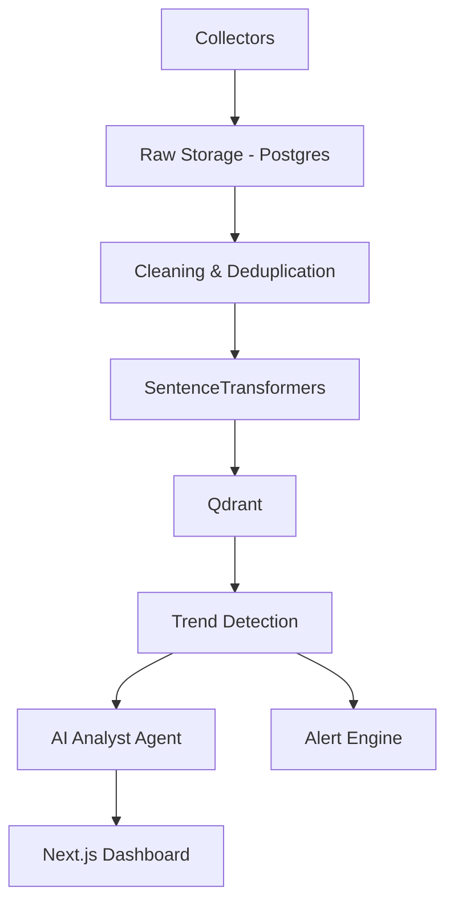

# Architecture - Trend Intelligence AI

## System Overview

## Data Flow

1. **Collection:** Multiple collectors (RSS, Web, YouTube) gather data every 15 minutes.
2. **Processing:** HTML cleaning, normalization, and language detection.
3. **Deduplication:** Hash-based and semantic deduplication.
4. **Vector Memory:** Articles are embedded and stored in Qdrant for semantic search.
5. **Trend Detection:** Scoring based on velocity, growth, source weight, and novelty.
6. **AI Analysis:** LLM-powered insights and report generation.

## Component Responsibilities

- **Backend (FastAPI):** Orchestrates data flow, provides REST APIs. Runs as a standalone Python process.
- **Qdrant:** Stores vector embeddings for semantic similarity and retrieval. (Expected as a local or managed service).
- **Redis:** Used for caching and task queuing (Celery in later phases). (Expected as a local or managed service).
- **Postgres:** Primary relational storage for metadata and raw content. (Expected as a local or managed service).
